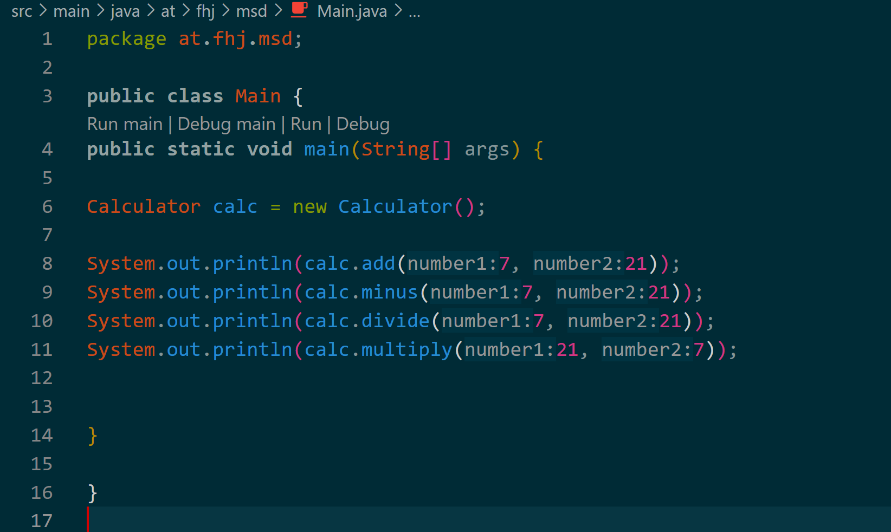
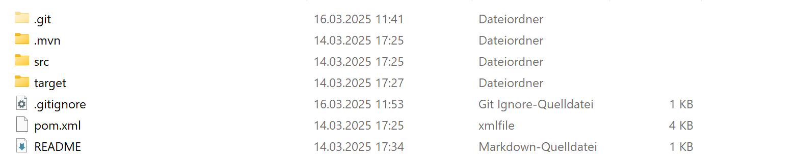
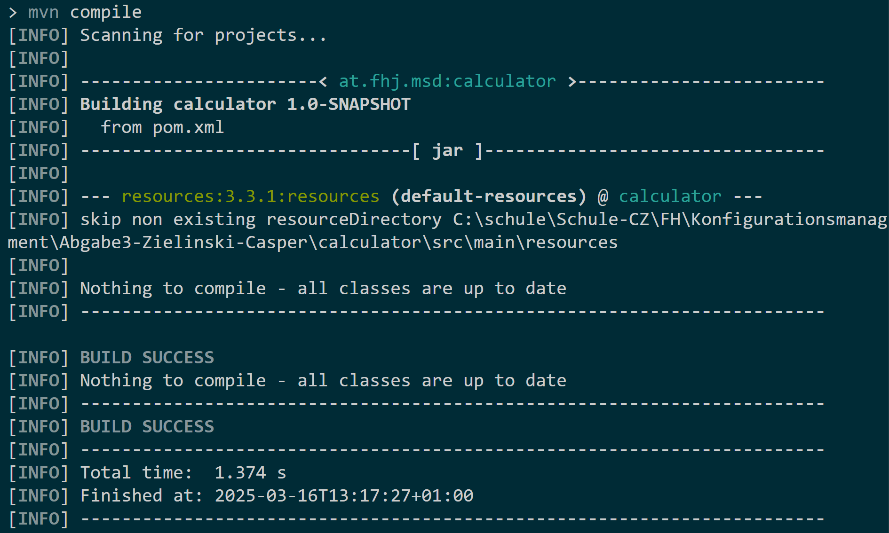

# Dokumentation

1. ``Calculator.java`` erstellt und die Methoden reinkopiert
2. Jeder Methode einen ``return`` Wert initialisiert
3. ``Main.java`` erstellt
4. In ``Main.java`` die Calculator Methoden getestet (In Pictures mit Bildern sichtbar)
5. Neue Dateien/Ordner: Calculator.class & Main.class

## Pictures

> Was in der Main Methode geschrieben war:
>

> Der Output davon:
>

>
> Der Dateipfad:

> Der Dateipfad des Projekter Calculator für die 3.Aufgabe
>
>Erfolgreicher Build mittels ``mvn compile``

